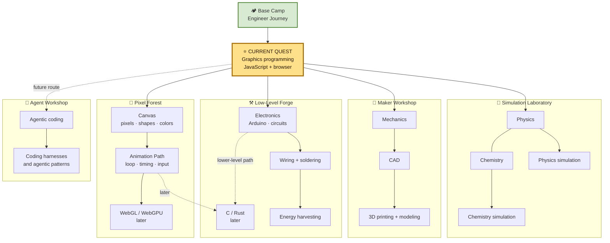

# Engineer Journey Map

An RPG-style view of the areas I want to explore. The star marks the current quest.

The map is allowed to change. I am not trying to learn everything at once; the current route is JavaScript graphics in the browser.
